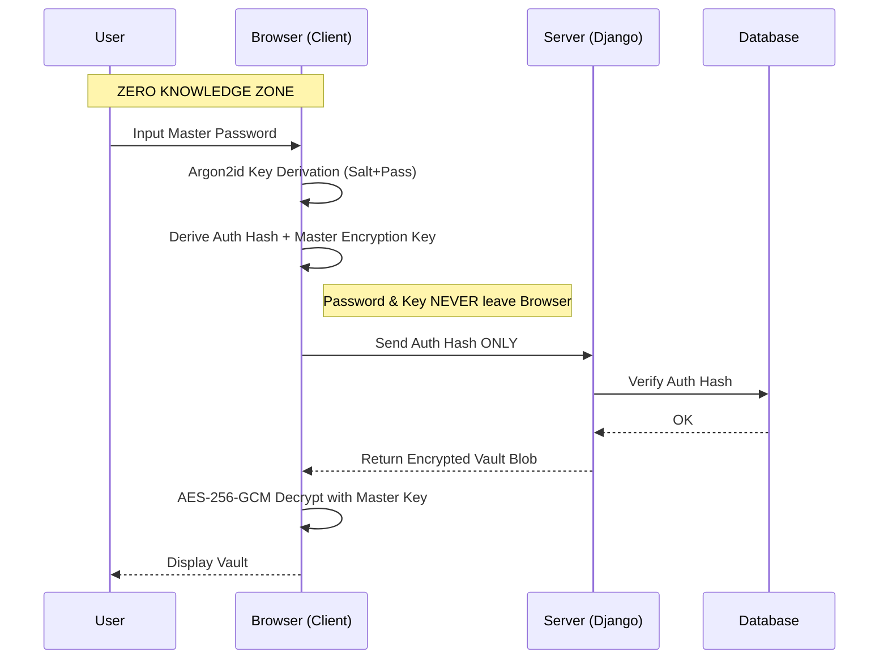

# AccountSafe

[](LICENSE)
[](frontend/)
[](backend/)
[](#why-accountsafe)

A self-hosted, zero-knowledge credential manager.

---

## Why AccountSafe

The server is blind.

AccountSafe encrypts all sensitive data in the browser before transmission. The server stores only ciphertext. A compromised database yields no usable information.



**The encryption key never leaves your device.**

---

## Features

### Zero-Knowledge Security
- **Zero-Knowledge Encryption**: AES-256-GCM with Argon2id key derivation (memory-hard KDF)
- **Zero-Knowledge Authentication**: Password never leaves your device; only derived `auth_hash` is transmitted
- **Zero-Knowledge Export/Import**: Encrypted vault backup that only you can decrypt

### Active Defense
- **Duress Mode (Ghost Vault)**: Alternate password reveals a decoy vault with fake credentials. Attacker sees low-value logins while your real vault stays hidden.
- **Canary Trap Credentials**: Fake credentials that trigger silent alerts when accessed - know immediately if your exported data is compromised.
- **SOS Email Alerts**: Automatic notification to a trusted contact when duress mode is activated.

### Security Intelligence
- **Security Health Score**: Real-time vault assessment (password strength, reuse, age, breach status)
- **Breach Detection**: Integration with Have I Been Pwned API
- **Session Management**: View and revoke active sessions across devices

### Secure Sharing
- **Shared Secrets**: Time-limited, passphrase-protected credential sharing
- **Auto-Expiry**: Shared links automatically expire and self-destruct

### Convenience
- **Digital Wallet**: Visual credit card storage with masked display
- **Smart Import**: Bulk import from browser password exports (Chrome, Firefox, Edge)
- **Brand Detection**: Automatic logo fetching for organisations

### Data Safety
- **Automated Backups**: PostgreSQL dumps every 6 hours with 7-day retention
- **One-Command Restore**: Full disaster recovery via `./scripts/restore.sh`
- **Encrypted Backups**: Optional GPG encryption for backup files

---

## Prerequisites

| Tool | Min Version | Notes |
|------|-------------|-------|
| Python | 3.10 | **Windows:** use `py` (Python Launcher) - see note below |
| Node.js | 18 | Includes npm |
| PostgreSQL | 15 | Must be running before starting the backend |
| Git | any | |
| Docker + Compose | any | Only required for the Docker path |

> **Windows Python note:** Install Python from [python.org](https://www.python.org/downloads/) and tick "Add to PATH". Use the `py` launcher (e.g. `py -m venv venv`) rather than `python` - this guarantees the official installation is used, not MSYS2 or the Microsoft Store stub.

---

## Quick Start

### Option A - Docker (recommended)

No PostgreSQL install needed. Handles everything with one command.

**Linux / macOS / Git Bash:**
```bash
git clone https://github.com/pankaj-bind/AccountSafe.git
cd AccountSafe
make dev          # builds images and starts backend + frontend with hot reload
```

**Windows (PowerShell - no `make` required):**
```powershell
git clone https://github.com/pankaj-bind/AccountSafe.git
cd AccountSafe
docker-compose -f docker-compose.local.yml up --build
```

Other Docker commands:

| Make (Linux/macOS) | PowerShell (Windows) |
|--------------------|----------------------|
| `make up` | `docker-compose -f docker-compose.local.yml up -d` |
| `make down` | `docker-compose -f docker-compose.local.yml down` |
| `make logs` | `docker-compose -f docker-compose.local.yml logs -f` |
| `make shell` | `docker-compose -f docker-compose.local.yml exec backend /bin/bash` |

---

### Option B - Native (no Docker)

PostgreSQL must be installed and running before starting the backend.

#### 1. Clone the repo

```bash
git clone https://github.com/pankaj-bind/AccountSafe.git
cd AccountSafe
```

#### 2. Backend

```bash
cd backend
```

**Create and activate a virtual environment:**

```bash
# Linux / macOS
python3 -m venv venv
source venv/bin/activate

# Windows - Command Prompt (recommended)
py -m venv venv
venv\Scripts\activate.bat

# Windows - PowerShell
py -m venv venv
.\venv\Scripts\Activate.ps1
# If you get an ExecutionPolicy error first run:
# Set-ExecutionPolicy RemoteSigned -Scope CurrentUser
```

**Install dependencies:**

```bash
pip install -r requirements-local.txt
```

**Configure environment - create `backend/.env`:**

```env
DEBUG=True
SECRET_KEY=django-insecure-dev-only-key-change-in-production
DB_NAME=accountsafe
DB_USER=postgres
DB_PASSWORD=postgres
DB_HOST=localhost
DB_PORT=5432
```

**Run migrations and start the server:**

```bash
python manage.py migrate
python manage.py runserver
```

Backend runs at `http://localhost:8000`.

---

#### 3. Frontend

Open a **new terminal** (keep the backend running):

```bash
cd frontend
npm install
npm start
```

Frontend runs at `http://localhost:3000`.

---

### PostgreSQL setup

**Linux (Debian/Ubuntu):**
```bash
sudo apt install postgresql
sudo systemctl start postgresql
sudo -u postgres psql -c "CREATE DATABASE accountsafe;"
```

**Windows:**
Download and install from [postgresql.org](https://www.postgresql.org/download/windows/). Then open **pgAdmin** or **psql** and run:
```sql
CREATE DATABASE accountsafe;
```

Default credentials used by this project: user `postgres`, password `postgres`, host `localhost`, port `5432`.

---

## Running Tests

### Windows (no `make`)

A dedicated batch script handles everything:

```bat
cd scripts

scripts\run_tests.bat            # all tests
scripts\run_tests.bat backend    # backend only
scripts\run_tests.bat frontend   # frontend only
```

### Linux / macOS

```bash
make test            # all tests
make test-backend    # backend only (pytest)
make test-frontend   # frontend only (jest)
```

### Manual (any platform)

**Backend - from `backend/` with venv activated:**

```bash
# Linux / macOS
source venv/bin/activate
python -m pytest -v

# Windows
venv\Scripts\activate.bat
python -m pytest -v

# With coverage
python -m pytest -v --cov=api --cov-report=term-missing
```

**Frontend - from `frontend/`:**

```bash
npm test -- --watchAll=false          # run once
npm test -- --watchAll=false --coverage  # with coverage
```

---

## Production Deployment

```bash
git clone https://github.com/pankaj-bind/AccountSafe.git
cd AccountSafe

# Configure environment files
cp backend/.env.example backend/.env
cp frontend/.env.example frontend/.env

# Initialise Let's Encrypt certificates
make init-ssl

# First deployment (builds images)
docker compose -f docker-compose.prod.yml up -d --build

# Subsequent runs
docker compose -f docker-compose.prod.yml up -d
```

> All dependencies are strictly pinned to prevent supply chain attacks. Always use `--build` after pulling new commits.

**Migrating from another server:**
```bash
# Copy the backups/ folder from the old server, then:
./scripts/restore.sh
```

---

## Architecture

| Component | Technology |
|-----------|------------|
| Frontend | React 18.3.1, TypeScript, Tailwind CSS |
| Backend | Django 5+, Django REST Framework 3.15+ |
| Database | PostgreSQL 15+ |
| Encryption | AES-256-GCM (Web Crypto API) |
| Key Derivation | Argon2id (memory-hard) |
| Auth | JWT with refresh rotation, Zero-Knowledge |
| Deployment | Docker Compose, Nginx, Let's Encrypt |

> **Dependency policy:** All versions are pinned exactly - no `^` or `~` - to prevent supply chain attacks via automatic upgrades. See [CONTRIBUTING.md](CONTRIBUTING.md).

---

## Documentation

| Document | Description |
|----------|-------------|
| [docs/API.md](docs/API.md) | API endpoints and request/response formats |
| [docs/CONFIGURATION.md](docs/CONFIGURATION.md) | Environment variables and deployment settings |
| [docs/DISASTER_RECOVERY.md](docs/DISASTER_RECOVERY.md) | Backup and restore runbook |
| [docs/ADMINISTRATION.md](docs/ADMINISTRATION.md) | System administration guide |
| [CONTRIBUTING.md](CONTRIBUTING.md) | Development setup and code standards |
| [SECURITY.md](SECURITY.md) | Vulnerability reporting and security policy |

---

## Troubleshooting

**`ModuleNotFoundError: No module named 'django'`**
Your venv was created with MSYS2 Python (its `venv` puts packages in `lib/` but Python looks elsewhere). Fix: recreate with the official `py` launcher.
```bat
cd backend
rmdir /s /q venv
py -m venv venv
venv\Scripts\activate.bat
pip install -r requirements-local.txt
```

**`venv\Scripts\Activate.ps1` not found**
Your venv was built with MSYS2 Python which places scripts in `bin/` not `Scripts/`. Use the fix above, or activate via `venv\bin\activate` if you intentionally used MSYS2.

**`can't open file 'manage.py'`**
Wrong directory. `manage.py` is inside `backend/`. Run `cd backend` first.

**`make` is not recognised (Windows PowerShell)**
`make` is not installed by default on Windows. Use the `docker-compose` commands directly (see the table in Option A) or install via `winget install GnuWin32.Make` and reopen your terminal.

**PostgreSQL connection refused**
Ensure PostgreSQL is running and the credentials in `backend/.env` match your local setup.

**Frontend port 3000 already in use**
```bash
# Linux / macOS
PORT=3001 npm start

# Windows PowerShell
$env:PORT=3001; npm start
```

---

## License

MIT. See [LICENSE](LICENSE).
